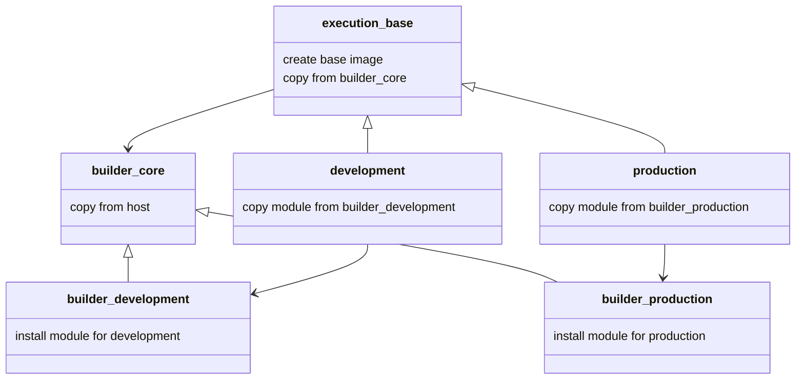

# docker-multistage-build

sample for docker multistage build

## architecture image



## check with docker compose

```bash
# show install modules

# production
docker compose run production pip freeze

# output:
# certifi==2022.6.15
# distlib==0.3.6
# filelock==3.8.0
# numpy==1.23.2
# platformdirs==2.5.2
# virtualenv==20.16.4
# virtualenv-clone==0.5.7

# flake8, autopep8 is not containe


# development
docker compose run development pip freeze
# output: omit

```
